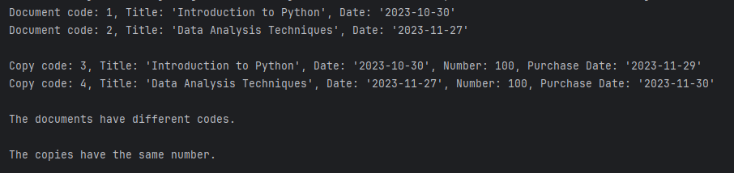

## Description
A program for managing documents and their copies in Java. It includes a Document class representing generic documents with attributes like title and date, and a Copy class inheriting from Document with additional attributes specific to copies, such as copy number and purchase date.
It demonstrates object-oriented programming principles in Java.
## Output

